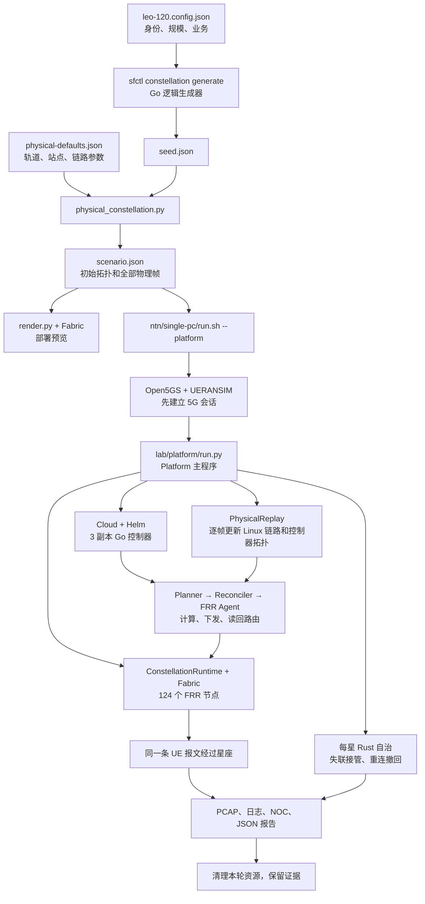

# 120 颗卫星：从文件到运行的学习手册

本文依据本地代码、生成配置和实际报告梳理。第 1 节起详细解释原有 `physical` 验收模式、120 星／4 网关配置；新增的持续实时模式先看下面的第 0 节。

**先记住一句话：两份 JSON 定义实验，Go 生成身份并负责算路，Python 计算轨道和组织运行，FRR／Linux 转发实际报文，Rust 在地面失联后接管备用路由，报告保存证据。**

配套索引：[全部工程文件的流程归属](120-satellite-file-index.md)、[本次通过记录的全部原始文件](120-satellite-evidence-index.tsv)。前者逐个列出工程文件，后者逐个列出该次运行的原始证据；重复的每星配置在本文按模板解释。

## 0. 新增：持续实时模式从哪里开始

打开 `http://127.0.0.1:8090/?mode=live`，或执行 `make live-start`。运行到主动停止，不受原有 300 秒／31 帧限制。详细说明见 [持续实时运行指南](../lab/live/README.md)。

```text
网页启动按钮 / make live-start
  → lab/live/service.py：独立于网页的单实例守护
  → ntn/single-pc/run.sh --live：准备 5G 与程序
  → lab/live/runtime.py：部署并保持运行
      → model.py：当前时间 → 轨道 / 接触 / 稳定接口地址
      → 原有 cloud / platform / FRR / Go 控制器：实际下发
      → heartbeat.py + Rust fallback_targets：心跳与动态自治
      → storage.py：业务计数、有限窗口、轮转日志
  → reports/live/status.json + snapshot.json
  → frontend/server.py → app.js / globe.js：实时展示
```

原有算路、转发、5G 和星上程序继续复用。运行器每次计算当时的新状态，直接更新真实软件网络；快照只保留最近 31 次供展示，这个窗口不限制总运行时长。

两条流程的区别：

| 项目 | 持续实时模式 | 原有物理验收模式 |
|---|---|---|
| 时间输入 | 当前 UTC 与单调时钟，持续计算 | 预先生成的有限物理帧 |
| 链路接口 | 新接触时创建，过期后回收 | 按已知帧的连接并集预建 |
| 星上备用下一跳 | 失联时查询本星当前 IGP 路由，运动后更新 | 原有验收阶段配置的备用路由 |
| 输出 | 滚动快照、业务计数、运行阶段 | 固定场景的完整验收报告 |
| 结束条件 | 点击停止或 `make live-stop` | 完成验收后清理 |
| 六种承载故障矩阵 | 作为独立验收入口保留 | 完整协议模式执行 |

目标更新间隔为 10 秒，实际受计算与设备下发耗时影响；界面展示采样年龄及耗时。轨道来自物理模型，未接入真实在轨卫星遥测。历史模式仍可查看下面各节所讲的验收证据。

## 1. 先弄清“120 星”究竟是什么

| 对象 | 当前配置／实际通过记录 | 理解方式 |
|---|---|---|
| 卫星身份 | `sat-0001`～`sat-0120` | 每颗有独立轨道输入和软件网络节点 |
| 轨道面 | 12 面，每面 10 星 | 用面号、槽位生成不同轨道相位 |
| 地面网关 | `gw-001`～`gw-004` | 当前对应多伦多、温哥华、法兰克福、新加坡的设计坐标 |
| FRR 节点 | 124 个 | 120 个卫星路由器＋4 个网关路由器 |
| 星上自治 | 120 个 Rust 进程，各由一个容器承载 | 与对应卫星 FRR 容器共享网络命名空间 |
| 云平台 | 3 个 Kubernetes 节点、3 个控制器副本 | 正常情况下只有持有 Lease 的主实例能修改状态 |
| 网关业务意图 | 8 条 | “从哪个网关到哪个网关、需要多少容量、是否要备用路” |
| 5G 业务 | 一套 gNB／UE 和一条持续 PDU 会话 | 不是给 120 颗卫星各建一个基站和终端 |
| 控制器业务意图总数 | 绑定后 10 条 | 8 条网关意图＋`n3-forward`／`n3-reverse` |
| 物理回放 | 300 秒，10 秒一步，共 31 帧 | 包含第 0 秒和第 300 秒；部署和验收另需时间 |

FRR 是路由软件；Linux 内核依据转发表真正转发 IP 报文。容器让每颗软件卫星具有独立网络环境。这套流程验证网络控制和数据传输，轨道是设计示例，Doppler 是计算结果中的元数据，没有在这条主线中作用于射频波形。

### 四个容易混淆的入口

| 命令 | 做什么 | 结果应去哪里看 |
|---|---|---|
| `make platform-configuration` | 编译程序、生成物理配置、生成部署预览；不创建卫星容器 | `PLATFORM_DIR` 下的 JSON 和 `deployment/` |
| `make test-physical-runtime` | 全量节点、云控制器、5G、物理回放、星上自治、地面恢复、NOC | `reports/physical-platforms/leo-120-4/latest.json` |
| `make test-unified`，等价于 `make test-platform` | 在同一平台增加六种承载的故障矩阵、云主实例切换和网络策略验证 | `reports/platforms/leo-120-4/latest.json` |
| `make test-constellation` | 逻辑拓扑＋内存设备的故障回归 | `reports/constellations/.../report.json` |

以下以第二条为主线，在第 10 节说明第三条增加什么。

## 2. 总图：文件如何串在一起



注意：`render.py` 是预览分支。运行器重新读取 `scenario.json`，再次通过同一个 `Fabric` 生成真实运行配置；它不直接拿 `deployment/routers/` 中的预览文件启动节点。

## 3. 第一站：两份输入 JSON

### 3.1 规模输入：`scenarios/constellations/leo-120.config.json`

| 字段 | 当前值 | 对主线的影响 |
|---|---:|---|
| `satellites` | 120 | 决定生成多少颗卫星 |
| `planes` | 12 | 必须整除星数；决定面号和槽位 |
| `gateways` | 4 | 决定需要哪些网关 ID 和坐标 |
| `flows` | 8 | 生成 8 条网关业务意图 |
| `demand_bps` | 10000000 | 每条上述意图需求 10 Mbit/s，用于规划容量约束 |
| `gateway_uplinks` | 3 | 逻辑种子的连接数；物理模式改由物理配置的终端限制决定 |
| `capacity_bps` | 10000000000 | 逻辑种子的链路容量；物理模式会重新计算链路容量 |
| `isl_latency_us` | 2000 | 逻辑种子的星间时延；物理模式会重新计算 |
| `feeder_latency_us` | 4000 | 逻辑种子的星地时延；物理模式会重新计算 |

即使随后替换逻辑链路，种子生成阶段仍执行自身的参数校验和主备路径预检查，所以这些逻辑字段也不能随意填无效值。

**业务需求是控制器的输入约束，不能把 `demand_bps=10000000` 读成“实验已经持续产生并测到 10 Mbit/s”。** 此处网关业务验收是实际 ping，持续 UE 流量也是 ping。

### 3.2 物理输入：`scenarios/constellations/physical-defaults.json`

| 参数组 | 关键字段 | 作用 |
|---|---|---|
| 时间 | `epoch`、`duration_seconds`、`step_seconds` | 固定轨道历元、总时长、采样间隔 |
| 轨道 | `orbit.source`、`altitude_km`、`inclination_deg`、`phasing` | 当前是 Walker 设计根数＋SGP4，1200 km、53°、相位因子 1 |
| 地面站 | `ground_stations` | 文件有 8 个设计站点，按当前 4 个网关 ID 选择前述 4 个 |
| 可见性 | 最小仰角、最大星地／星间距离、地球净空 | 决定几何上能否连接 |
| 终端 | 每星 ISL 终端、同面终端、馈电终端、每站终端数 | 能看见不等于有空闲终端连接 |
| 捕获 | `acquisition_seconds=2` | 新接触经过捕获后才可用；事件边界仍受 10 秒采样限制 |
| 时延 | `processing_delay_us=100` | 几何传播时延之外增加的处理时延 |
| 容量 | `isl`／`feeder` 的参考 SNR、带宽、效率、容量上限 | 按距离计算链路容量 |
| 队列 | `packet_loss_ppm`、`queue_limit_packets` | 写入实际内核队列的丢包和排队设置 |

该文件也支持 `orbit.source=tle` 或 `oem`，此时还需逐星 catalog。当前默认流程不读取 `lab/orbit-closed-loop/inputs/tle-catalog.json`。

### 3.3 修改时应找哪一个文件

- 改星数／轨道面／网关数／意图数：改 `leo-120.config.json`。
- 改高度／倾角／站点坐标／历元／时长／终端数／物理链路容量模型：改 `physical-defaults.json`。
- 换一份物理配置：使用 `PHYSICS_CONFIG=自己的文件.json`。
- 改每条链路如何映射成接口、地址和 FRR 命令：才需要看 `lab/platform/fabric.py`。
- 改主备算路规则：看 `internal/policy/` 和 `internal/planner/planner.go`。

`CONSTELLATION_CONFIG` 一旦设置，Makefile 只传 `--config`，不再传 `SATELLITES` 等规模参数。因此在 Make 命令后加 `SATELLITES=60` 不会覆盖 JSON。直接调用 `sfctl` 时显式 CLI 参数可以覆盖 JSON，这是另一个层面的规则。

使用当前文件内容才能得到 12 面。仅运行不带配置的默认 Make 入口时 `PLANES=0` 会自动选面数，不能只凭 `SATELLITES=120` 就认定还是 12 面。

## 4. 第二站：把输入编译成场景

### 4.1 编译与种子生成

真实调用链：

```text
Makefile: platform-configuration → build
  → go build → bin/sfctl
  → cmd/sfctl/main.go：识别 constellation 子命令
  → cmd/sfctl/constellation.go：读 JSON、处理 flags
  → internal/constellation/constellation.go：Generate()
  → seed.json + seed-summary.json
```

`Generate()` 建立卫星 ID、网关 ID、`logical_plane`／`logical_slot`、逻辑环网和业务意图，并调用规划器检查初始、断链、断星时是否有主备路径。它还生成供内存回归使用的故障时间线。

`go.mod`／`go.sum` 记录 Go 依赖。`Makefile build` 顺带编译 inventory、OpenConfig 和 QUIC 工具；被编译不等于参与此轮卫星业务。

### 4.2 物理编译

| 文件／函数 | 上游输入 | 本步做什么 | 下游 |
|---|---|---|---|
| `tools/physical_constellation.py:load_config()` | 两份输入 | 校验参数，选择网关坐标，解析可选 catalog | `Orbits`、`Contacts` |
| `Orbits` | 面／槽＋轨道参数 | 为每颗星建立独立根数，按时刻得到位置和速度 | 每帧全星座状态 |
| `tools/tle_to_oem.py:propagate()` | SGP4 对象和时刻 | 被当作函数复用进行传播 | 位置／速度；此处不运行它的 CLI，也不自动生成 OEM 文件 |
| `tools/ephemeris_contacts.py` | 位置／速度／站点 | 复用 TEME 坐标、地球自转、仰角、遮挡、距离、时延、Doppler 和 OEM 读取函数 | 候选接触及物理量 |
| `Contacts.frame()` | 候选接触 | 按几何条件、终端预算、捕获状态调度当前连接 | 本帧方向链路 |
| `compile_scenario()` | 全部帧 | 替换逻辑链路，构造全时段连接并集和 `physical_model`，清空逻辑故障时间线 | `scenario.json` |
| `tools/requirements-orbit.txt` | Python 安装环境 | 轨道计算依赖清单 | 生成器运行环境 |

编译前还会传播一段捕获预热时间。每个采样点保存每星状态，**并非把两颗示例卫星的轨道复制到 120 个名字上。**

可以用三步理解物理参数：

1. 距离和光速给出传播时延，再加处理时延。
2. 参考 SNR 随距离平方衰减，再由带宽和效率估算容量，并受配置上限约束。
3. `loss_ppm` 来自显式配置，不能当成已经从射频误码率计算得到。

### 4.3 输出文件的结构

当 `PLATFORM_DIR=reports/physical-config/120-4` 时：

```text
reports/physical-config/120-4/
├── seed.json                 逻辑种子：身份、逻辑连接、8 条意图
├── seed-summary.json         逻辑种子统计
├── scenario.json             物理场景：节点、连接并集、8 条意图、31 帧
├── topology-summary.json     物理场景统计
├── path-preflight.json       可选的全帧路径预检查结果
└── deployment/
    ├── deployment-manifest.json   预览清单，instantiated=false
    └── routers/
        ├── sat-0001/frr.conf
        ├── ...
        ├── sat-0120/frr.conf
        └── gw-001～gw-004/frr.conf
```

`scenario.json` 的关键层次：

```text
topology.nodes          谁在网络中
topology.links          整个实验可能出现的方向链路，当前是否 up
intents                 希望实现哪些业务连接
physical_model.config   解析后的物理配置
physical_model.satellite_orbits   每颗星的轨道来源／根数
physical_model.frames   每个时刻的状态和链路
physical_model.connectivity       每帧连通分量
timeline                此时为空；不再跑逻辑种子的故障剧本
```

当前物理摘要中有 **252 对可能连接，504 条方向链路；开始时 250 对可用，各帧为 249～250 对**。一对链路的两个方向可分别配置队列。252 是全时段预建连接并集，不是“任何时刻都有 252 对连通”。

`tools/preflight_physical.py` 是可选的离线检查：逐帧调用 `sfctl scenario validate --check-paths`，既检查原来的 8 条业务，也通过 `Fabric` 加入 5G 的两条意图。图只有一个连通分量仍不保证容量和主备约束成立，路径检查比简单连通检查更进一步。

## 5. 第三站：把抽象场景变成网络

### 5.1 `Fabric` 是最重要的转换点

`lab/platform/render.py` 和实际运行器都调用 `lab/platform/fabric.py:Fabric`。

它负责：

1. 建立节点、邻接关系、方向链路表。
2. 分配 loopback、接口、点对点 IP、MPLS SID、SRv6 locator。
3. 给节点加入实际 `frr_container`、`probe_target`、相邻下一跳地址标签。
4. 将 8 条网关意图映射为 `10.240.0.x/32` 的真实测试目的地址。
5. 选择第一条网关意图的两端作为 N3 网关，加入正反两个 N3 意图。
6. 将庞大的 `physical_model` 从控制器场景移出，交给 Python 回放器保管。
7. `config(node)` 生成 FRR 配置；`wiring(pids)` 生成 Linux 接线命令。

因此存在两种同名文件：

- `reports/physical-config/120-4/scenario.json`：物理模型输入，有 8 条原始意图和全部物理帧。
- `lab/unified/artifacts/<run_id>/scenario.json`：控制器实际读取的绑定场景，有 10 条意图、实际 IP 和容器标签；物理帧另存 `physical-model.json`。

### 5.2 哪个 Python 文件真正管哪一层

```text
lab/unified/run.py        Runtime：通用命令、HTTP、时间线、ping 等基础工具
            ↑ 继承
lab/platform/constellation_runtime.py
                         ConstellationRuntime：全量星座部署、业务、逐星自治
            ↑ 继承
lab/platform/run.py       Platform：组合云控制器、协议、物理／完整两种验收模式
```

**`lab/unified/run.py` 仍然是主线依赖。** 但它内部旧的四节点建网、两星轨道编译等方法已被子类覆盖，不能据此说新主线还在运行那套四节点实验。

### 5.3 逐节点落地涉及的文件

| 文件 | 作用 |
|---|---|
| `lab/platform/constellation_runtime.py` | `network()` 为每个节点创建 FRR 容器，生成实际配置，等待全图邻接，做逐节点和网关业务探测 |
| `lab/platform/fabric.py` | 统一分配地址、接口、SID；生成配置和接线任务 |
| `lab/platform/wire.py` | 在指定网络命名空间中执行接线任务，建立 veth 和相关接口 |
| `lab/platform/channel.py` | 将链路时延、容量、丢包和队列大小转换为 `tc netem` 命令；还处理 FRR 度量和带宽单位 |
| `lab/platform/resources.py` | 评估／调整 inotify 预算，为 gNB／UE 预留 CPU，限制本轮工作负载，结束恢复预算 |
| `lab/containerlab/protocol-matrix/configs/vtysh.conf` | 复用的 FRR CLI 配置文件，实际挂载给节点 |
| 运行目录 `routers/<节点>/frr.conf` | 本轮真正挂载给 FRR 的配置 |
| 运行目录 `routers/<节点>/daemons` | 本轮动态生成的路由进程启用列表 |

这里不是通过一个含有 124 个节点的静态 `topology.clab.yml` 来部署。节点由 Python 根据配置循环创建。

`lab/containerlab/protocol-matrix/configs/daemons` 被列入源码哈希范围，但当前全星座 `network()` 会自己写 `daemons`。所以“报告记录了文件哈希”不能直接证明该文件内容被运行时使用。

### 5.4 看懂一颗星的 FRR 配置

以 `sat-0001` 为例，实际通过记录中的 loopback 为 `10.255.0.5/32`；排序编号先包括 4 个网关，所以不是 `10.255.0.1`。

| 配置片段 | 你应理解的作用 |
|---|---|
| `hostname sat-0001` | 节点身份 |
| `interface lo`、`ip address .../32` | 稳定的路由器地址 |
| `router ospf`、`router ospf6` | IPv4／IPv6 底层路由进程 |
| `router isis SF` | IS-IS 路由域，提供拓扑和 SR 相关信息 |
| `segment-routing prefix ... index 5` | 该节点的 SR Prefix SID 关联 |
| `interface sf15` 等 | 指向邻居的点对点链路，编号由绑定器分配 |
| `ip ospf area`、`ip router isis SF` | 哪些链路参与路由协议 |
| `mpls ldp` | 标签分发配置 |
| `interface sr0` | SRv6 locator 使用的虚拟接口 |

其余 119 颗星复用同一个生成规则，但节点身份、地址、邻居和接口绑定各不相同。要学的是生成规则和一两个具体例子，无须背下 120 份重复文本。

## 6. 第四站：先建立 5G，再启动平台

主入口是 `ntn/single-pc/run.sh --platform`。

| 顺序 | 文件 | 作用 |
|---|---|---|
| 1 | `versions.env` | 固定上游仓库 commit、Open5GS／UERANSIM／Mongo 镜像版本 |
| 2 | `prepare_lab.py` | 检查同名容器归属；只处理本项目已停止的遗留容器 |
| 3 | `.cache/ntn/docker_open5gs/` | 从固定上游版本取 Compose、核心网和 UE／gNB 配置；这部分缓存是运行依赖 |
| 4 | `core-images.yaml` | 覆盖核心网相关镜像和部署参数 |
| 5 | `gnb-image.yaml` | gNB 镜像覆盖 |
| 6 | `ue-image.yaml` | UE 镜像覆盖 |
| 7 | `run.sh` | 启动核心网，等待 Mongo，就绪后配置测试用户；启动 gNB、UE 并等 PDU 成功 |
| 8 | `verify.py` | 检查真实 N2/N3 基线，生成 `reports/5g-sa-baseline.json` |
| 9 | `lab/platform/run.py` | 接管后续星座集成运行 |

几个术语：UE 是终端，gNB 是基站，UPF 是核心网用户面转发节点，N3 是 gNB 与 UPF 之间的用户面通路，GTP-U 是承载用户报文的隧道封装。

**这里实际使用的 5G Compose 来自上游缓存。** 仓库内 `ntn/open5gs/amf.yaml`、`smf.yaml`、`upf.yaml` 以及 `ntn/srsran/*.yml` 属于其他集成配置，并非本条默认主线直接读取的配置。

物理主线中的报文关系：

```text
UE 的用户报文
  → UERANSIM gNB
  → GTP-U / N3
  → gw-001 → 当前选中的若干卫星 → gw-002
  → Open5GS UPF
  → 实验目的地址 192.168.100.1
回复沿 n3-reverse 所规划的路径返回
```

`ConstellationRuntime.route_n3()` 在 gNB 和 UPF 增加路由，使已有会话的 N3 报文经过星座；`Platform.pdu_identity()` 比较前后的 UE 容器、PDU 建立次数和隧道地址，检查是否一直是同一会话。

## 7. 第五站：云端控制器怎样把“想走的路”变成实际路由

### 7.1 云部署文件

| 文件 | 本流程的实际角色 |
|---|---|
| `lab/platform/cloud.py` | 为同一星座准备 Kubernetes 控制器、FRR Agent、动态 Helm values 和访问代理 |
| `lab/cloud/runtime.py` | 被复用的 `Cluster` 工具；构建镜像、创建 kind、安装 Cilium／Hubble、准备镜像和存储 |
| `Dockerfile`、`.dockerignore` | 定义控制器镜像构建内容；Dockerfile 包含 Go 测试，再构建控制器和工具 |
| `deploy/helm/starfabric/Chart.yaml` | Helm 包元信息 |
| `deploy/helm/starfabric/values.yaml` | 默认值，由运行器生成的 `platform-values.json` 覆盖 adapter、场景、副本数等 |
| `templates/_helpers.tpl` | 公共命名和标签 |
| `templates/configmap.yaml` | 将绑定后的 `scenario` 写入控制器 ConfigMap |
| `templates/deployment.yaml` | 控制器参数、镜像、挂载、就绪检查、资源等 |
| `templates/service.yaml` | 控制器服务地址 |
| `templates/serviceaccount.yaml`、`leader-rbac.yaml` | 服务账号和 Lease 所需权限 |
| `templates/pvc.yaml` | 控制器持久状态卷声明 |
| `templates/pdb.yaml` | 自愿驱逐时的最小可用性配置 |
| `templates/cilium-network-policy.yaml` | 实际控制器访问策略 |
| `templates/NOTES.txt` | Helm 安装提示 |

`values-ha.yaml` 不是该入口直接传入的 `-f` 文件；HA 值由 `Cluster.values('ha')` 和 `Cloud.prepare()` 动态生成。`servicemonitor.yaml` 是可选监控模板，当前 NOC 直接配置 Prometheus 抓取。`deploy/cilium/values.yaml` 也不是该次 kind 安装所读取的值文件，安装参数来自 `Cluster.create()`。

### 7.2 Go 控制器核心文件

| 文件 | 负责什么 | 与前后文件怎样连接 |
|---|---|---|
| `cmd/sf-controller/main.go` | 启动服务、选择 `frr` adapter、开启 Lease、设定超时和状态目录 | 读取场景后创建 `App` 和 API |
| `internal/scenario/scenario.go` | 场景读取与校验；文件内也含独立实验能力 | 主线使用加载／校验部分 |
| `internal/model/model.go` | `Node`、`Link`、`RouteIntent`、`RoutePlan`、事件和状态的共同格式 | Go 模块用这些类型交换数据 |
| `internal/api/server.go` | HTTP API | 接受批量拓扑事件、预览、reconcile 和状态请求 |
| `internal/app/app.go` | 组合拓扑、意图、规划器、设备和事务流程 | `Preview()` 算路，`Reconcile()` 算路后执行 |
| `internal/topology/store.go` | 带版本的拓扑状态，处理序号、重复／过期事件、批量原子更新 | 每帧得到一个一致版本 |
| `internal/planner/planner.go` | 按优先级和容量约束生成业务的主备路径及逐节点操作 | 调用策略，返回 `RoutePlan` |
| `internal/policy/path.go` | 最短路径、可用链路过滤、备份路径约束 | 当前业务主要按时延选路 |
| `internal/policy/plugin.go` | 策略注册和选择 | 将意图中的 `policy` 交给相应算法 |
| `internal/validation/validation.go` | 计划版本、期限、路径等提交前校验 | 防止拿过期计划继续写路由 |
| `internal/reconcile/reconciler.go` | Prepare／Commit／读回／失败回滚／持久化 | 将计划拆到设备并分批提交 |
| `internal/adapter/adapter.go` | 设备接口和注册表；还包含内存实现 | 本次用接口／注册表和真实 FRR 实现 |
| `internal/adapter/frr/frr.go` | 路由操作转换为 `vtysh` 命令；读 FRR 已安装状态；保留回滚状态 | 真正的设备适配层 |
| `internal/adapter/frr/http.go` | 访问远端 FRR 执行代理 | 让无特权的 Kubernetes 控制器管理本机 FRR 容器 |
| `lab/platform/frr_agent.py` | 有认证、限定节点和命令的执行代理 | 收到操作后执行本轮容器中的 `vtysh`／`ping`，写审计日志 |
| `internal/verification/routeprobe.go` | 读取设备实际路由并验证计划路径 | 不仅检查控制器内存中的期望值 |
| `internal/adapter/frr/ping.go` | 从源节点 ping 目的节点的探测地址 | 是路由器可达性探测；UE 持续报文由平台另行验证 |
| `internal/durable/file.go` | 持久状态写盘 | 拓扑、意图、提交状态、adapter 状态在重启后恢复 |
| `internal/leadership/kubernetes.go` | Kubernetes Lease 主实例选举 | 限制写入者，接任时配合恢复状态 |
| `internal/observability/log.go`、`metrics.go`、`otel.go` | 日志、指标、追踪 | NOC 采集并与时间线关联 |

`internal/app/predictive.go` 和 `internal/predictive/engine.go` 是同一控制器的预测接触调度能力。当前物理主线通过 `PhysicalReplay` 逐帧批量发布拓扑，不调用逻辑回归那条 `/predictive/schedules` 切换分支。不能把物理回放简单等同于预测式提前切换。

### 7.3 一次 `reconcile` 的实际顺序

```text
POST /api/v1/reconcile
 → API → App.Reconcile()
 → Preview() → Planner.Build() → policy：主备路径
 → Reconciler.Apply()
 → 校验版本、有效期和路径
 → 检查设备健康，读取实际路由
 → Prepare：为各设备准备本次变更和回滚状态
 → 按批次 Commit；每批后读回核验
 → 整体路径核验＋路由器实际 ping
 → 持久化，标记 committed
出错 → 进入失败处理，尝试回滚已准备／修改的设备
```

“事务”描述控制器组织操作和补偿回滚的方式，并不是让所有 Linux 路由器在同一个 CPU 指令周期内同时更新。

### 7.4 用真实计划读懂抽象结构

通过记录 `sf-unified-d180f84868` 的 `initial-commit.json` 中，`n3-forward` 初始主路径是：

```text
gw-001 → sat-0063 → sat-0044 → sat-0072 → sat-0053 → gw-002
```

主路径模型单向链路时延合计 `24742 us`，即 `24.742 ms`；这是模型中的链路时延和，不是该次 UE ping 的实测 RTT。

初始备份路径是：

```text
gw-001 → sat-0054 → sat-0053 → sat-0034 → gw-002
```

两路可以共享卫星节点（此处共享 `sat-0053`），因此不要把默认主备理解为所有中间卫星完全分离。默认控制器 `NodeDisjoint=false`。

`plan.paths` 说明“经过哪些节点”；`plan.routes` 进一步说明“在哪个设备上，为哪个目的前缀，写哪个下一跳和优先级”。例如网关业务的一条实际记录：

```json
{
  "device": "gw-001",
  "prefix": "10.240.0.1/32",
  "next_hop": "10.128.0.10",
  "next_hop_node": "sat-0063",
  "metric": 100,
  "intent_id": "flow-00001",
  "path_role": "primary"
}
```

可以翻译为：“网关 1 去往这条业务的目的地址时，将报文交给卫星 63 的相邻接口地址。” 物理模式绑定相邻接口下一跳，避免通过 loopback 递归选出与控制器计划不同的下一跳。

## 8. 第六站：31 帧怎样改变实际报文

这一步重点读 `lab/platform/physics_runtime.py:PhysicalReplay.run()`。

| 顺序 | 执行者 | 发生什么 |
|---|---|---|
| 1 | `PhysicalReplay` | 按真实墙钟等待这一帧的时刻；显式 1:1 回放 |
| 2 | `snapshot_links()` | 当前帧未出现的预建链路标为不可用 |
| 3 | `channels()` | 先关闭失效接口，更新时延／速率／丢包，再打开新接触 |
| 4 | `channel.py` | 构造内核 `tc netem` 参数 |
| 5 | `physics_jobs.py` | 在本轮命名空间中并发执行；同一节点的连续 `tc` 命令合为批处理 |
| 6 | `verify_readback()` | 首帧和末帧读回全部接口、队列和 `rp_filter`；地面恢复时另读回保持快照 |
| 7 | `publish()` | `POST /api/v1/topology/events/batch`，整个采样点原子变成一个拓扑版本 |
| 8 | Go API／拓扑存储 | 接受新观测，供规划器读取 |
| 9 | `PhysicalReplay` | 请求新计划预览；路由操作改变时才调用 reconcile |
| 10 | 平台 | UE 持续 ping 不间断，记录每帧耗时、版本、活跃链路和是否重写路由 |

不是每一帧都重写 FIB：距离微调可能改变时延，但最优路径和下一跳仍相同。通过记录中 31 帧只有 10 次重写，属于正常行为。

底层 OSPF／IS-IS 在物理模式使用固定跳数度量；控制器依据物理时延／容量算业务路径；内核队列执行实际时延和限速。这三层的职责不同。

`rp_filter` 是 Linux 的源地址反向路径检查。正反向业务可能经过不同卫星，该平台关闭本轮接口上的检查并核验，避免合法回复被丢弃。

31 帧结束后，网络保持最终轨道快照。恢复地面控制器时 `refresh_held_snapshot()` 先读回实际接口和队列，再发布新的观测时间；轨道时间仍是最后一帧，不会假装卫星又运动了一段时间。

## 9. 第七站：120 个 Rust 进程怎样自治

### 文件分工

| 文件 | 作用 |
|---|---|
| `onboard/Cargo.toml`、`Cargo.lock` | Rust 项目及锁定依赖 |
| `onboard/src/main.rs` | 启动 HTTP 服务、接收心跳 generation、后台检查超时、执行接管／撤回 |
| `onboard/src/routing.rs` | 校验、安装和删除自己拥有的 Linux 备用路由 |
| `onboard/src/state.rs` | 保存 connected、generation、fallback 等状态 |
| `onboard/src/lib.rs` | 导出模块和原子写盘工具 |
| `onboard/src/update.rs` | 签名 A/B 更新能力；前置星上专项会测试它，120 星业务阶段不逐星升级 |
| `onboard/config.example.json` | 模板；运行器替换节点 ID 和备用路由 |
| `onboard/run-closed-loop.py` | `test-onboard` 前置专项，检查真实 Rust 进程、持久化、超时和签名更新；它自身用 dry-run 路由 |
| `onboard/target/release/satellite-node-runtime` | 编译产物，120 份实例共享这个程序 |
| 运行目录 `<sat-id>-onboard/config.json` | 为该星生成的 N3 正反方向备用下一跳 |
| 运行目录 `<sat-id>-onboard/state/state.json` | 该星实际持久状态 |

### 自治顺序

1. 物理回放结束，Python 根据最终图为每颗星算好两个方向的备用下一跳。
2. 启动 120 个 Rust 进程，各自加入对应 FRR 的网络命名空间。
3. Python 检查云端 `/readyz`，用本机管理通道向每星转发带递增 generation 的心跳。
4. `autonomy()` 将云控制器副本缩为 0，心跳停止。
5. 每颗星等待心跳超时后安装自己的备用路由；平台等到全星座都报告 `fallback_active`。
6. 从业务路径上的一颗星撤去面向 UPF 的地面静态路由，读内核下一跳并发 UE 报文，证明备用路由实际转发。
7. 云控制器恢复，刷新保持快照，重新 reconcile。
8. 恢复心跳，120 颗星撤回本地备用路由，继续验证业务。

这里的“自治”是失联检测后执行预配置备用路由。备用下一跳由 Python 预先计算，当前 Rust 进程没有在轨独立传播整个星座并动态重新算图。心跳也通过本机管理通道传递。

## 10. 完整协议入口增加哪些流程

`lab/platform/run.py` 中唯一关键分叉：

```python
if args.focus == 'full':
    runtime.protocols.exercise()
    runtime.cloud.failover()
    runtime.cloud.policy()
```

物理专项也调用 `protocols.setup()`，会配置／检查底层协议；省去的是逐承载故障矩阵和两种云故障专项。

| 文件 | 完整入口增加的作用 |
|---|---|
| `lab/platform/protocols.py` | 依次选择承载，断开同一业务路径的链路，验证恢复，重新打开链路并验证 |
| `lab/platform/pce.py` | PCEP 请求／响应服务器，使用当前计划并检查 BGP-LS 实时图 |
| `lab/platform/packets.py` | 解码同一个包内的封装与 GTP-U，按时间窗口核验 |
| `lab/platform/capture.py` | 在全部卫星命名空间中启动抓包，保存每星 PCAP |
| `lab/platform/cloud.py:failover()` | 删除主实例，检查新主接任、状态和实际业务 |
| `lab/platform/cloud.py:policy()` | Cilium 阻断／恢复控制 API，核验 Hubble 记录和持续数据面 |

六种承载分别是 OSPF、LDP、SR-MPLS、PCEP 驱动 SR 路径、SRv6、EVPN/VXLAN。BGP-LS 负责把拓扑告诉路径计算侧，PCEP 本身是控制协议；“PCEP 承载”在这里指它建立的 SR 业务路径。

每种承载分别验证初始、断链后恢复、链路恢复三个时间窗口。不同承载依次运行，不要求一个包同时套上所有封装。

完整入口的顺序是：**保持初始轨道快照做协议／云故障验证 → 31 帧物理回放 → 最终快照上星上自治／地面恢复**。

`capture.py` 和 `packets.py` 在物理专项也使用，用来证明 native GTP-U 报文经过卫星；`pce.py` 会被导入，但 physics 分支不启动 PCE 服务。

## 11. 第八站：监控怎样证明这是同一次运行

主文件是 `lab/unified/noc.py`，由 `Runtime` 创建、`Platform` 启动和验证。

| 文件 | 本流程如何使用 |
|---|---|
| `deploy/observability/otel-collector.yaml` | 作为模板，替换端口、日志路径、run ID、下游地址 |
| `deploy/observability/loki.yaml` | 日志后端模板 |
| `deploy/observability/tempo.yaml` | 追踪后端模板 |
| `deploy/observability/grafana/dashboards/starfabric.json` | 看板模板，加入本轮标签 |
| `deploy/compose/docker-compose.yaml` | 读取五个监控服务的镜像定义，再生成本轮 Compose |
| 运行目录 `noc/compose.json` | 本轮实际启动的监控服务定义 |
| 运行目录 `noc/prometheus.json`、`alerts.json` | 本轮实际抓取和告警设置，由 Python 生成 |
| 运行目录 `noc/provisioning/` | 本轮实际 Grafana 数据源和看板配置 |

Prometheus 负责指标，Loki 负责日志，Tempo 负责追踪，Grafana 展示它们，OTel Collector 负责接收和转送日志／追踪。

静态的 `deploy/observability/prometheus.yml`、`alerts/starfabric.yml` 和 Grafana provisioning 文件是其他部署入口的配置；本次 NOC 为动态端口和 run ID 自己生成对应文件。

验证输出包括 `topology-metric.json`、`loki-correlated-logs.json`、`tempo-api-trace.json`、`outage-alert.json`、`grafana-datasources.json`、`grafana-dashboard.json`，用于关联同一控制器、计划和地面中断事件。

## 12. 最后产出了哪些文件，应该按什么顺序看

### 12.1 三个层次

1. `scenarios/constellations/`：长期维护的输入。
2. `reports/physical-config/120-4/`：可重新生成的配置与预览。
3. `reports/.../latest.json` ＋它指向的 `lab/unified/artifacts/<run_id>/`：实际运行结果和证据。

`latest.json` 会被后续运行覆盖。研究某次结果时应同时记住 `run_id`，阅读相应运行目录中的 `platform-report.json`。

### 12.2 当前已通过的物理专项

报告：[120 星物理专项 latest](../reports/physical-platforms/leo-120-4/latest.json)。

| 项目 | 记录 |
|---|---|
| `run_id` | `sf-unified-d180f84868` |
| 报告时间 | `2026-09-15T14:53:55Z` 附近，UTC |
| `success` | `true` |
| `physical_runtime_integration` | `true` |
| `full_protocol_integration` | `false`，此专项未执行完整矩阵 |
| 实际部署 | 124 个 FRR 节点、120 个星上实例、3 个 Kubernetes 节点 |
| 物理回放 | 31 帧、10 次路由重写、最慢帧约 8.079 秒 |
| 持续流量 | 3860 发／3853 收，约 0.181% 丢包 |
| 平台资源清理检查 | `owned_resources_cleaned=true` |

该运行目录实际包含 **872 个文件**，逐个列在配套 TSV 索引中。本文核对时，报告 `source_sha256` 列出的文件与当前本地文件哈希全部一致；这个清单不是对所有依赖／所有配置的全覆盖证明。

完整协议入口的最新 120 星报告：[完整入口 latest](../reports/platforms/leo-120-4/latest.json)，其 `run_id=sf-unified-0209fe1206`，`success=false`。不应用历史逻辑模式通过报告替代当前物理模式完整协议结果。

### 12.3 原始证据文件分类

以下路径相对于 `lab/unified/artifacts/sf-unified-d180f84868/`。

| 文件／模式 | 谁生成 | 你能从中学到什么 |
|---|---|---|
| `platform-report.json` | 平台主程序 | 本轮范围、总结果、检查项、流量、源码哈希 |
| `constellation-input.json` | `compile_orbit()` | 原始物理输入副本 |
| `scenario.json` | `Fabric`＋运行器 | 云控制器收到的实际场景 |
| `physical-model.json` | 运行器从输入拆出 | 每星轨道和全部物理帧 |
| `deployment-manifest.json` | 运行器 | 本轮节点、链路、N3 网关绑定 |
| `resource-estimate.json` | `check_resources()` | 估算内存和启动前可用内存 |
| `host-budget.json`、`radio-cpu-budget.json` | `HostBudget` | inotify、CPU 预算及恢复记录 |
| `physical-path-preflight.log` | 运行器调用 sfctl | 初始绑定场景的路径预检查 |
| `routers/*/frr.conf`、`routers/*/daemons` | `network()` | 124 个节点真正使用的初始配置 |
| `wiring.json`、`wiring.log` | `network()`／`wire.py` | 实际接口创建和接线 |
| `fleet-inventory.json` | `network()` | 容器、PID、进程、邻接和运行配置 |
| `fleet-probes-initial.json`、`fleet-probes-after-faults.json` | `fleet_probe()` | 每个节点的实际可达性 |
| `gateway-business-*.json` | `gateway_probe()` | 8 条业务地址的实际 ping |
| `initial-commit.json` | `reconcile()` | 初始主备路径和逐设备路由 |
| `service-path-selection.json` | `prepare_paths()` | 初始业务路径、故障边和抓包相关选择 |
| `protocol-initial-protocol-state.json` | `Protocols.setup()` | 全节点初始 OSPF、IPv6、LDP、LFIB，网关 BGP-LS／EVPN 状态 |
| `physical-jobs-0.json`～`physical-jobs-30.json` | `PhysicalReplay.channels()` | 每帧准备执行的内核命令 |
| `physical-channels-0.json`～`physical-channels-30.json` | `physics_jobs.py` | 执行结果；首末帧有完整读回，其余帧不能当作完整队列读回 |
| `physical-2.json` 等 | `reconcile()` | 仅路由改变时生成的提交结果，不是每帧一个 |
| `physical-replay.json` | `PhysicalReplay.run()` | 所有帧、耗时、版本、链路变化、实际重写次数 |
| `physical-held-snapshot.json`、`physical-*-held-*.json` | 地面恢复时刷新 | 最终轨道时间与新实际观测时间的区别 |
| `onboard-inventory.json` | `start_onboard()` | 120 个进程启动后的状态 |
| `sat-*-onboard/config.json`、`state/state.json` | Python／Rust | 各星备用路由及持久状态 |
| `fleet-autonomous.json` | `autonomy()` | 全星座超时后进入自治的状态 |
| `autonomous-kernel-fib.json` | `autonomy()` | 选定星的内核下一跳确实使用备用路由 |
| `ground-restored-commit.json` | `reconcile()` | 地面恢复后的实际提交 |
| `pdu-identity-initial.json`、`pdu-identity-final.json` | `Platform` | 会话身份前后比较 |
| `continuous-ping.log` | UE 长时间 ping | 全部阶段连续流量，不局限于每阶段短探测 |
| `ping-*.log` | `Runtime.ping()` | 指定阶段的短探测 |
| `capture-namespaces.json`、`native-capture-ready.json` | 捕获器 | 120 个抓包点对应的命名空间及启动状态 |
| `native-sat-*.pcap`、`native-sat-*-tcpdump.log` | `capture.py` | 各星抓到的原始包和抓包日志 |
| `protocol-packet-proofs.json` | `packets.py`＋`capture_finish()` | 从同一包中识别 GTP-U；区分抓包节点数和实际转发节点 |
| `controller.log` | Go 控制器 | 拓扑接收、提交、回滚等事件 |
| `frr-agent.jsonl` | FRR Agent | 对哪个节点执行了什么命令、退出码和时间 |
| `timeline.json`、`timeline.jsonl` | `Runtime.event()` | 整个实验的统一时间线；JSONL 每行一个事件 |
| `last-http-error.json` | HTTP 包装函数 | 最近一次 HTTP 错误；故障注入期间也可能出现，存在它不等于总运行失败 |
| `cloud/*.json`、`cloud/*.log` | 云组件 | 镜像构建、kind 节点、控制器 Deployment、Lease 和最终状态 |
| `noc/*` | NOC | 监控实际配置、查询结果、启动和清理日志 |

完整协议运行还会增加各承载 PCAP、分阶段协议状态、PCEP 消息、SR LFIB 校验、BGP-LS 修复、云故障等证据；它们不应被假定存在于 physics 专项目录中。

### 12.4 清理和持久化也属于流程

`lab/platform/run.py` 在 `finally` 中关闭协议服务、星座／星上容器、NOC、kind 和资源预算，再写最终平台报告；外层 `ntn/single-pc/run.sh` 的 EXIT trap 继续清理 5G Compose 栈。

外层 5G 清理日志是 `reports/5g-cleanup.log`，默认保留 Mongo 测试卷。因此 `owned_resources_cleaned` 对应平台内部清理；判断整个 Make 命令成功还要看外层退出状态与 5G 清理结果。配置、报告、编译产物和部分缓存会保留。

控制器持久状态实际由 `.cache/cloud-runtime/<cluster-id>/shared/ha/` 挂到容器 `/data`，包含拓扑、意图、事务及逐设备 adapter 状态。它与供学习的“报告文件”角色不同，集群恢复期间会重新读取。

## 13. 建议这样学：每一步都能回答一个问题

| 轮次 | 读什么 | 学完应能回答 |
|---|---|---|
| 1 | 两份输入 JSON＋第 1～4 节 | 120 颗星从哪里来？哪些参数真正决定物理连接？ |
| 2 | `scenario.json` 的一颗星、一条链路、一帧＋`Fabric` | 节点 ID 如何变成 IP、接口和容器？ |
| 3 | `run.py:main()`＋继承关系 | 从启动到清理，实际阶段如何排序？ |
| 4 | `initial-commit.json`＋model／planner／reconciler／frr | 一条业务如何变成每一跳的实际路由？ |
| 5 | `physics_runtime.py`＋第 2 帧 jobs／提交／时间线 | 距离变化后，为什么有时只调队列、有时还要改路？ |
| 6 | Rust main／routing／state＋自治证据 | 地面掉线后谁安装路由，什么时候撤回？ |
| 7 | PCAP 汇总＋NOC 查询＋最终报告 | 怎样证明报文、控制器和告警属于同次实验？ |
| 8 | `protocols.py`、`pce.py` 和独立学习实验 | 完整协议流程比物理专项多验证了什么？ |

### 不启动容器的阅读练习

在工程根目录执行，只读取现有文件：

```bash
python3 - <<'PY'
import json
from pathlib import Path

root = Path('.')
report = json.loads((root / 'reports/physical-platforms/leo-120-4/latest.json').read_text())
art = root / report['artifacts']
plan = json.loads((art / 'initial-commit.json').read_text())['plan']
replay = json.loads((art / 'physical-replay.json').read_text())
print('运行：', report['run_id'])
print('实际部署：', report['deployed_counts'])
print('N3 主路：', ' → '.join(plan['paths']['n3-forward'][0]['nodes']))
print('N3 备路：', ' → '.join(plan['paths']['n3-forward'][1]['nodes']))
print('回放帧数：', len(replay['frames']))
print('实际改路：', sum(f['routes_reprogrammed'] for f in replay['frames']))
print('逐项检查：', report['checks'])
PY
```

需要重新生成配置时，使用独立学习目录，避免覆盖当前证据输入：

```bash
make platform-configuration \
  CONSTELLATION_CONFIG=scenarios/constellations/leo-120.config.json \
  PLATFORM_DIR=reports/learning-120

python3 tools/preflight_physical.py \
  --scenario reports/learning-120/scenario.json \
  --output reports/learning-120/path-preflight.json
```

实际整套运行入口：

```bash
make test-physical-runtime \
  CONSTELLATION_CONFIG=scenarios/constellations/leo-120.config.json \
  PLATFORM_DIR=reports/learning-120
```

若要执行完整协议矩阵，将目标改为 `test-unified`。`test-physical-packets` 只做独立物理通道报文验证，不代表 124 个 FRR 节点全部运行。

## 14. 最后：哪些文件不在这条主流程中

这里的“不在流程”指**没有作为这次默认 120 星物理业务的直接输入／执行步骤**，不等于文件没用或可以删除。逐文件状态见配套索引；下表解释整组边界。

### 14.1 独立实验、其他设备和其他规模

| 文件／目录 | 为什么不在这条主线 |
|---|---|
| `learning/lesson01-data-plane/` | 小网络数据面教学，适合补基础，主入口不调用 |
| `learning/lesson02-isis-control-plane/` | IS-IS 教学 |
| `learning/lesson03-bfd-convergence/` | BFD 收敛教学 |
| `learning/lesson04-isis-lfa/` | LFA 本地修复教学 |
| `lab/containerlab/phase1-frr-otg/` | 独立 4 路由器＋OTG 验收 |
| `lab/containerlab/advanced-protocols/` | 独立高级协议实验 |
| `lab/containerlab/protocol-matrix/` | 独立协议矩阵；例外是 `configs/vtysh.conf` 被主线挂载复用 |
| `lab/orbit-closed-loop/` | 旧的两星／小网络轨道到 FRR 专项；当前逐星物理编译不读取其 inputs |
| `lab/openconfig/`、`lab/kne/`、`lab/sonic/`、`tests/ondatra/` | OpenConfig／设备平台／外部测试床入口；本轮 adapter 为 FRR |
| `lab/p4/`、`lab/dataplane/` | P4、XDP 独立数据面专项 |
| `lab/batfish/` | 独立静态网络分析，当前提交前验证并未调用 Batfish |
| `lab/linux-networking/`、`lab/qos/` | Linux 网络／QoS 独立专项 |
| `lab/srsran/` | srsRAN 独立专项；主线用 UERANSIM |
| `lab/api/`、`lab/inventory/`、`lab/reliability/`、`lab/security/` | API、资产、高可用／可靠性、安全的独立专项 |
| `lab/cloud/validate.py`、`lab/cloud/observability.py` | 独立云／监控验收；主线复用的是 `lab/cloud/runtime.py` |
| `ntn/experiment.py`、`experiments/*.json`、`channel_emulator.py`、`qos-mapping.json` | NTN 独立实验和信道／QoS 配置，不是物理主线的逐帧执行器 |
| `ntn/starfabric-transport.json`、`ntn/single-pc/ntn-transport.json` | `run.sh` 的 component 分支使用；`--platform` 分支不使用 |
| `ntn/single-pc/validate_r17_channel.py`、`geo-ntn-r17.yaml`、`ntn/srsran/`、`ntn/open5gs/` | R17／srsRAN 等其他配置和验证 |
| `onboard/qemu/`、`onboard/packaging/` | ARM64 SIL、systemd、Buildroot、Yocto 打包；当前直接运行本机 Rust 程序 |
| `scenarios/constellations/leo-360.config.json` | 另一规模输入，当前明确选用 120 星 JSON |
| `scenarios/frr-diamond.json`、`frr-phase1-controller.json`、`contact-plan.example.csv` | 其他示例场景 |
| `tools/contactplan.py` | 接触 CSV 到预测场景的独立工具；当前物理生成器直接输出全部物理帧 |
| `cmd/sf-inventory/`、`internal/inventory/` | NetBox／Nautobot 导入；工具会随 build 编译，本轮不导入 inventory |
| `cmd/sf-openconfig-emulator/`、`cmd/sf-openconfig-probe/`、`internal/adapter/openconfig/` | 其他 adapter／工具分支，会参与构建或测试，当前业务不选择它们 |
| `cmd/sf-quic-probe/` | QUIC 专项工具，随 build 编译，本轮持续流量不是它产生的 |
| `internal/ois/`、`internal/sharding/` | 独立 OIS 状态机和分片模块；当前物理接触在 Python 计算，主控制链未调用这两项 |
| `internal/verification/otg.go` | 可选 OTG 计数器核验；本轮未设置 `--otg-api` |
| `internal/report/html.go` | sfctl 内存实验 HTML 报告，不生成平台 JSON 总报告 |

### 14.2 工程保障、文档和可选部署

| 文件组 | 正确归类 |
|---|---|
| `internal/*_test.go`、`cmd/*_test.go` 及包内测试 | 构建前置测试；Dockerfile 构建阶段执行其复制范围内的 `go test ./...`，Docker 层缓存可能复用结果 |
| `onboard/src/` 内 Rust 测试 | `test-onboard` 明确执行；与 120 星运行期业务逻辑分开理解 |
| `lab/platform/test_*.py`、`tools/test_*.py`、`ntn/test_*.py` | Python 回归测试；由 `make test-python` 等入口执行，主物理入口不会自动跑这些 Python 测试 |
| `tests/chaos/`、`tests/scale/`、`internal/testutil/` | 质量验证／测试工具，不是每帧处理链 |
| `api/openapi.yaml`、`api/proto/`、`gen/starfabric/v1/`、`internal/api/grpc.go` | API 合同、生成代码和可选 gRPC；本流程主要通过 HTTP 访问，未启用 gRPC listener |
| `scenarios/leo-resilient.json` | Docker 镜像默认样例，会被复制进镜像；本轮 Helm ConfigMap 覆盖实际启动场景 |
| `deploy/helm/starfabric/values-ha.yaml`、`servicemonitor.yaml` | HA 示例值／可选监控模板；当前实际使用动态 values 和直接 Prometheus 抓取 |
| `deploy/gitops/application.yaml`、`deploy/cilium/values.yaml` | GitOps 和另一套 Cilium 声明式入口，本轮不读取 |
| 静态 Prometheus／告警／Grafana provisioning | 本轮 NOC 动态生成对应配置；Loki／Tempo／OTel／看板模板仍复用 |
| `scripts/bootstrap-host.sh`、`scripts/verify-host.sh`、`deploy/host/starfabric-mpls.conf` | 主机准备与检查，通常运行前人工使用，主入口不自动调用 |
| `tools/single_pc.py`、`core_acceptance.py`、`verify_single_pc_closure.py`、`verify_coverage.py`、`dependency_security.py` | 全工程验收、覆盖和依赖检查；范围比单条 120 星流程大 |
| `docs/single-pc-suite.json`、`single-pc-closure.json`、`coverage-manifest.json` | 上述质量工具的输入清单，不是星座场景配置 |
| `README.md`、`docs/*.md`、各目录 README、根目录设计长文 | 阅读材料，不由主线解释执行；历史结论要区分模式和时间 |
| `.github/`、`.gitignore` | CI／依赖维护／文件管理规则 |

### 14.3 生成物、缓存和空目录

- `reports/` 中其他规模、其他实验和历史失败轮次的报告不被主线当作运行输入；它们可用于学习和诊断。当前 `PLATFORM_DIR/scenario.json` 是明确例外，会作为本轮输入读取。
- `lab/unified/artifacts/<其他 run_id>/` 是其他运行证据。不能混合几个 run ID 拼成一次通过结果。
- `bin/` 和 `onboard/target/` 是编译产物；其中 `sfctl`、Rust 可执行文件确实被主线使用，不能整目录判为无关。
- `.cache/ntn/docker_open5gs/`、云工具／Cilium chart 缓存、本轮 `.cache/cloud-runtime/<id>/` 与流程相关。Go／Rust／Python 缓存不是需要逐文件学习的业务源码。
- `lab/p4/build/`、Batfish snapshot、已有 `.log`／PCAP 属于相应专项的生成物。
- 检查时 `route-agent/include/`、`route-agent/src/`、`.agents/`、`.codex/`、`.git/` 未提供可读业务文件；`route-agent` 不是本轮 FRR 执行代理，真正代理是 `lab/platform/frr_agent.py`。当前目录也不是可用的 Git 仓库。

最终应能在脑中复述这条链：

**输入参数 → 节点和意图 → 逐星轨道／接触帧 → 地址和 FRR 配置 → 5G 会话和云控制器 → 算路并提交 → 逐帧改变实际链路／队列 → 星上失联接管 → 地面恢复 → 报文／监控证据 → 清理和报告。**
